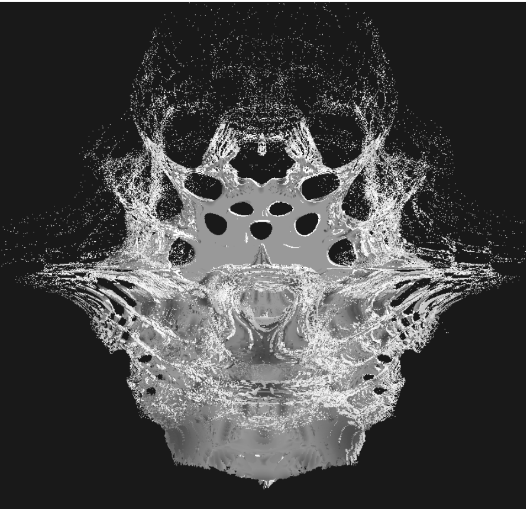
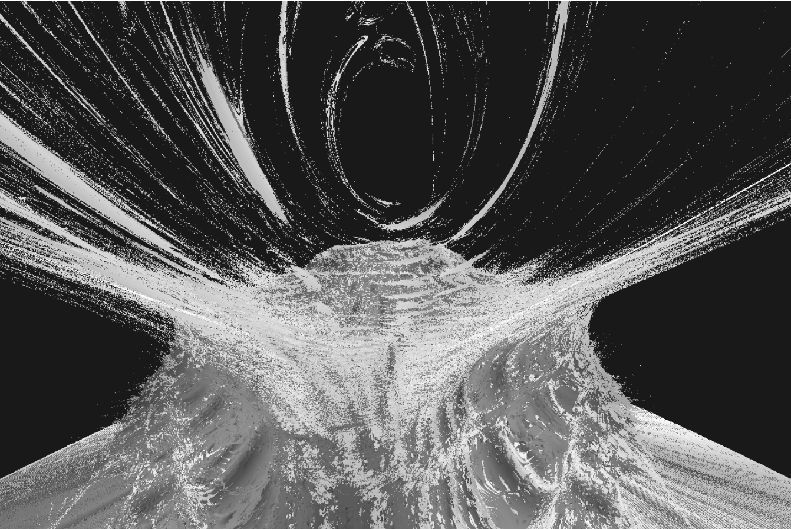

# abrichardson00.github.io
A little website which renders 3D Mandelbulb fractals. Made using Javascript, WebGL and a shader in GLSL using ray-marching.
Live Demo: https://abrichardson00.github.io/
Generates things like:
  

  

